# Editor Menu Sitemap

最終更新: 2026-02-17
対象: `index.html`, `js/app.js`

## 1. PCエディター (Desktop, 幅1024px以上)

### 1.1 リボン上段
| メニュー名 | 機能説明 |
| --- | --- |
| Home | 編集基本操作タブを表示。Undo/Redo、保存、共有、プロジェクト名・作品タイトル編集、Pages/Edit パネル表示切替を提供。 |
| Insert | コンテンツ追加タブを表示。セクション追加、吹き出し追加、画像追加を実行。 |
| Arrange | 配置・表示調整タブを表示。全体表示、画像位置/サイズ調整、キャンバスズーム、言語タブ切替を提供。 |
| Export | 出力タブを表示。`.dsf` エクスポートとプロジェクト一覧表示を提供。 |
| Project | プロジェクト管理タブを表示。新規作成、既存プロジェクトを開く、言語タブ切替を提供。 |
| Sign in with Google | Google認証のログイン/ログアウト。未ログイン時はクラウド機能(保存/共有/画像アップロード等)を無効化。 |

### 1.2 Home タブ内
| メニュー名 | 機能説明 |
| --- | --- |
| Undo | 直前の編集操作を取り消し。 |
| Redo | Undoした編集をやり直し。 |
| Save | Firebaseへプロジェクトを保存。 |
| Share | ビューワーURLを生成して共有。 |
| Project (編集可能) | プロジェクト名をインライン編集。 |
| Title | 作品タイトルを入力・更新。 |
| Pages | 左側のページ一覧パネル表示/非表示を切替。 |
| Edit | 右側の編集パネル表示/非表示を切替。 |

### 1.3 Insert タブ内
| メニュー名 | 機能説明 |
| --- | --- |
| セクション追加 | 新しいページ/セクションを末尾に追加。 |
| 吹き出し追加 | 現在セクションに吹き出しを追加。 |
| 画像追加 | 画像ファイルをアップロードして背景画像に適用。 |

### 1.4 Arrange タブ内
| メニュー名 | 機能説明 |
| --- | --- |
| 全体表示 | キャンバス表示をフィット状態に戻す。 |
| 画像調整 | 背景画像の位置・サイズ調整モードを切替。 |
| Canvasズーム | 25〜400% と 100%/Fit のクイック変更。 |
| Language Tabs | 編集対象言語の切替。 |

### 1.5 Export タブ内
| メニュー名 | 機能説明 |
| --- | --- |
| エクスポート (.dsf) | 現在プロジェクトを `.dsf` ファイルとして出力。 |
| プロジェクト一覧 | プロジェクト一覧モーダルを開く。 |

### 1.6 Project タブ内
| メニュー名 | 機能説明 |
| --- | --- |
| 新規プロジェクト | 初期状態の新規プロジェクトを作成。 |
| 開く | プロジェクト一覧から既存データを開く。 |
| Language | プロジェクト言語の切替UIを表示。 |

### 1.7 サイドメニュー
| メニュー名 | 機能説明 |
| --- | --- |
| Pagesパネル | セクションサムネイル一覧、並び替え、列数切替、セクション追加を提供。 |
| Editパネル | セクションタイプ、背景画像変更/調整、吹き出し形状、テキスト編集、削除、言語設定を提供。 |
| キャンバス補助ボタン | 吹き出し追加FAB、全体表示、画像ズーム(+/-/リセット)を提供。 |

### 1.8 モーダル
| メニュー名 | 機能説明 |
| --- | --- |
| プロジェクト一覧モーダル | 保存済みプロジェクトの閲覧・選択、`＋ 新規プロジェクト`、`閉じる` を提供。 |

## 2. モバイルエディター (Mobile, 幅1024px未満)

### 2.1 下部メニュー (Bottom Bar)
| メニュー名 | 機能説明 |
| --- | --- |
| Home | アクションシート(Undo/Redo/Save/Share/Auth)を表示。 |
| Pages | ページ一覧シートを表示。 |
| Add | 追加シート(セクション追加/吹き出し追加/画像追加)を表示。 |
| Edit | 編集シート(右パネル相当)を表示。 |
| Export | 出力シート(Save/Share/エクスポート/プロジェクト一覧)を表示。 |
| Lang | 言語タブシートを表示。 |

### 2.2 モバイルヘッダー
| メニュー名 | 機能説明 |
| --- | --- |
| Sign in | Google認証のログイン/ログアウトを実行。 |

## 3. 画面遷移サイトマップ

### 3.1 Desktop

```mermaid
flowchart TD
    Editor[Editor]
    Ribbon[Ribbon]
    Pages[Pages Panel]
    Canvas[Canvas]
    Edit[Edit Panel]
    Modal[Project Modal]
    HomeTab[Home Tab]
    InsertTab[Insert Tab]
    ArrangeTab[Arrange Tab]
    ExportTab[Export Tab]
    ProjectTab[Project Tab]
    Auth[Sign in with Google]

    Undo[Undo]
    Redo[Redo]
    Save[Save]
    Share[Share]
    ProjectName[Project Name]
    Title[Title]
    TogglePages[Pages Toggle]
    ToggleEdit[Edit Toggle]

    AddSection[セクション追加]
    AddBubble[吹き出し追加]
    AddImage[画像追加]

    FitView[全体表示]
    ImageAdjust[画像調整]
    CanvasZoom[Canvas Zoom]
    LangTabs[Language Tabs]

    ExportDsf[エクスポート .dsf]
    OpenProjects[プロジェクト一覧]

    NewProject[新規プロジェクト]
    OpenProject[開く]
    ProjectLang[Language]

    ThumbList[サムネイル一覧/並び替え]
    ThumbCols[列数切替]
    SidebarAdd[セクション追加]

    SectionProps[セクション設定]
    BubbleShape[吹き出し形状]
    TextEdit[テキスト編集]
    DeleteActive[削除]
    LangSettings[言語設定]

    Editor --> Ribbon
    Editor --> Pages
    Editor --> Canvas
    Editor --> Edit
    Ribbon --> Modal
    Ribbon --> HomeTab
    Ribbon --> InsertTab
    Ribbon --> ArrangeTab
    Ribbon --> ExportTab
    Ribbon --> ProjectTab
    Ribbon --> Auth

    HomeTab --> Undo
    HomeTab --> Redo
    HomeTab --> Save
    HomeTab --> Share
    HomeTab --> ProjectName
    HomeTab --> Title
    HomeTab --> TogglePages
    HomeTab --> ToggleEdit

    InsertTab --> AddSection
    InsertTab --> AddBubble
    InsertTab --> AddImage

    ArrangeTab --> FitView
    ArrangeTab --> ImageAdjust
    ArrangeTab --> CanvasZoom
    ArrangeTab --> LangTabs

    ExportTab --> ExportDsf
    ExportTab --> OpenProjects

    ProjectTab --> NewProject
    ProjectTab --> OpenProject
    ProjectTab --> ProjectLang

    Pages --> ThumbList
    Pages --> ThumbCols
    Pages --> SidebarAdd

    Edit --> SectionProps
    Edit --> BubbleShape
    Edit --> TextEdit
    Edit --> DeleteActive
    Edit --> LangSettings
```

### 3.2 Mobile

```mermaid
flowchart TD
    EditorM[Editor]
    Bottom[Bottom Bar]
    Home[Home Sheet]
    PagesM[Pages Sheet]
    Add[Add Sheet]
    EditM[Edit Sheet]
    Export[Export Sheet]
    Lang[Lang Sheet]
    ModalM[Project Modal]
    SignIn[Sign in]

    MUndo[Undo]
    MRedo[Redo]
    MSave[Save]
    MShare[Share]
    MAuth[Auth]

    MAddSection[セクション追加]
    MAddBubble[吹き出し追加]
    MAddImage[画像追加]

    MEditSection[セクション設定]
    MEditText[テキスト編集]
    MEditDelete[削除]
    MEditLang[言語設定]

    MExportSave[Save]
    MExportShare[Share]
    MExportDsf[エクスポート]
    MExportProjects[プロジェクト一覧]

    MLangTabs[Language Tabs]
    MPagesThumb[サムネイル一覧/並び替え]
    MPagesCols[列数切替]

    EditorM --> Bottom
    EditorM --> SignIn
    Bottom --> Home
    Bottom --> PagesM
    Bottom --> Add
    Bottom --> EditM
    Bottom --> Export
    Bottom --> Lang
    Export --> ModalM

    Home --> MUndo
    Home --> MRedo
    Home --> MSave
    Home --> MShare
    Home --> MAuth

    Add --> MAddSection
    Add --> MAddBubble
    Add --> MAddImage

    EditM --> MEditSection
    EditM --> MEditText
    EditM --> MEditDelete
    EditM --> MEditLang

    Export --> MExportSave
    Export --> MExportShare
    Export --> MExportDsf
    Export --> MExportProjects

    Lang --> MLangTabs
    PagesM --> MPagesThumb
    PagesM --> MPagesCols
```

## 4. 補足
- `Save`, `Share`, `画像追加`, `プロジェクト一覧/開く` は `data-auth-required` 指定でログイン前は制限される。
- タブ切替は `setRibbonTab()`、モバイル下部メニュー切替は `openMobileSheet()` で制御される。
